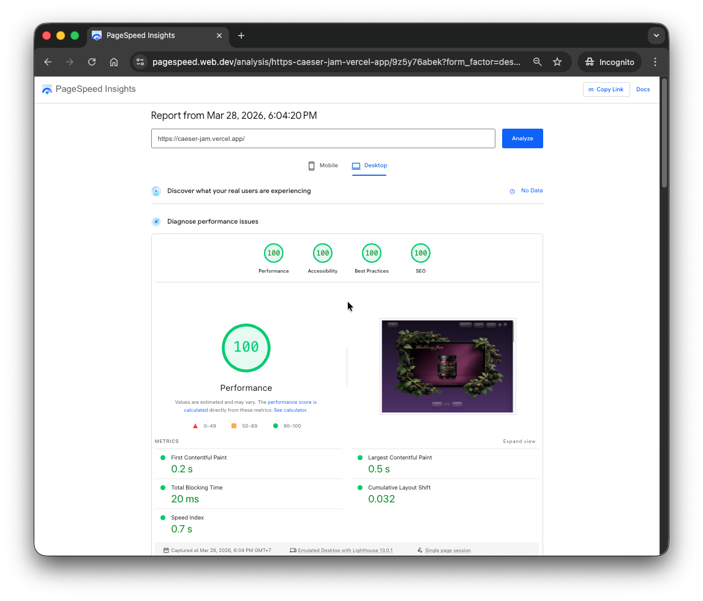
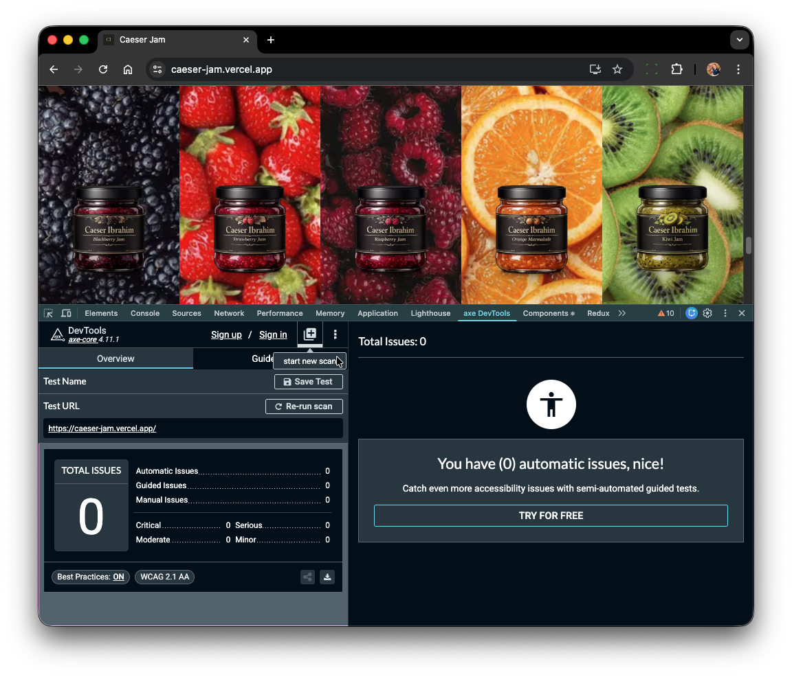

# Caeser Jam

  
  

A premium portfolio-style jam brand website designed and built to showcase luxury visual design, refined frontend craftsmanship, and polished user experience.

**Live site:** [caeser-jam.vercel.app](https://caeser-jam.vercel.app)

## Overview

Caeser Jam is a modern luxury website concept built with a strong focus on presentation, interaction, accessibility, and performance.  
The project combines elegant visuals with a clean frontend architecture to create a rich, high-end browsing experience inspired by premium product branding.

The site features immersive product presentation, smooth interaction design, a custom cart experience, responsive layouts, and carefully styled UI components throughout.

## Highlights

- Luxury-inspired visual design
- Custom animated UI components
- Responsive layout across screen sizes
- Product slider and showcase sections
- Cart drawer interaction
- Contact form integration
- Performance-focused image handling
- Clean, reusable component structure

## Web Vitals & Lighthouse Performance

  
  

This project achieved **100% in all Lighthouse categories**:

- Performance
- Accessibility
- Best Practices
- SEO

The site was carefully optimized for fast loading, accessible interaction, strong semantic structure, and overall frontend quality.

## Tech Stack

- **Next.js 16**
- **React**
- **TypeScript**
- **Tailwind CSS**
- **CSS Modules**
- **Vercel**

## Features

### Custom UI and motion

The site uses custom-built components and transitions to create a premium feel, including animated buttons, layered visuals, and polished hover states.

### Product presentation

Each section was designed to make the products feel elevated and editorial, with strong imagery, clean typography, and carefully balanced spacing.

### Cart experience

A custom cart drawer allows users to add products, adjust quantities, and view totals in a smooth and visually consistent interface.

### Contact page

The contact experience includes a refined glass-style layout with form submission handling and clear status feedback.

### Performance and accessibility

Special attention was given to image delivery, touch targets, contrast, semantic markup, and responsive behavior to ensure a high-quality user experience.

### Project Goal

The goal of Caeser Jam was to create a visually striking, premium-feeling website that demonstrates both design sensitivity and frontend engineering quality.
It serves as a portfolio project focused on luxury branding, interaction detail, and production-minded implementation.

### Deployment

Deployed on Vercel:

caeser-jam.vercel.app

Author

Caeser Ibrahim
Full Stack Software Engineer
London, UK
